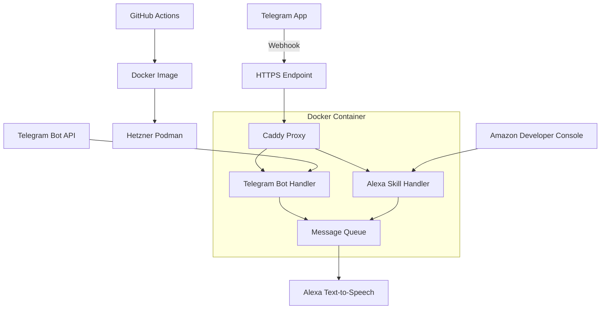

# Telegram to Alexa Integration Architecture

## System Overview
This system allows Telegram messages to be spoken through Alexa devices. It consists of:
- Telegram Bot Webhook
- Alexa Skill Handler
- Message Queue
- Caddy Reverse Proxy
- Docker/Podman Deployment
- CI/CD Pipeline

## Technology Stack
- **Python**: 3.12
- **Web Framework**: FastAPI
- **Reverse Proxy**: Caddy 2.7
- **Message Queue**: Redis
- **Containerization**: Docker/Podman
- **CI/CD**: GitHub Actions

## Component Details

### 1. Alexa Skill Handler
- Implements ASK SDK for Python
- Handles Alexa requests
- Processes messages from queue
- Manages authentication with Amazon

### 2. Telegram Bot
- Webhook endpoint
- Message processing
- Command handling
- Authentication with Telegram API

### 3. Message Queue (Redis)
- Async message processing
- Message persistence
- Rate limiting
- Error handling

### 4. Caddy Reverse Proxy
- Automatic HTTPS with Let's Encrypt
- Request routing
- Load balancing
- Security headers

### 5. Docker/Podman Setup
- Multi-stage build
- Python environment
- Caddy configuration
- Redis integration

### 6. CI/CD Pipeline
- Automated builds
- Image tagging
- Security scanning
- Deployment to Hetzner

## Workflow Diagram

## Environment Variables
- `TELEGRAM_BOT_TOKEN`: Telegram bot authentication
- `ALEXA_APP_ID`: Alexa skill verification
- `DOMAIN_NAME`: HTTPS endpoint
- `LETSENCRYPT_EMAIL`: SSL certificate
- `REDIS_URL`: Message queue connection

## Implementation Steps
1. Set up project structure
2. Implement Alexa Skill
3. Create Telegram Bot
4. Configure Caddy
5. Set up message queue
6. Create Docker setup
7. Configure GitHub Actions
8. Write README documentation